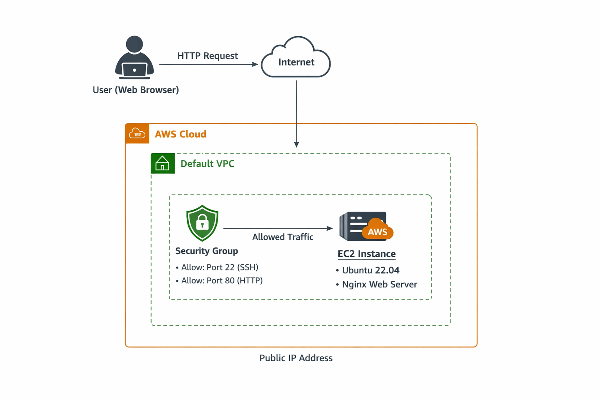

# EC2 Launch Project (AWS)

## Architecture Diagram



---

## Project Overview

This project demonstrates how to:

* Launch an EC2 instance in AWS
* Configure security groups
* Connect using SSH
* Install and run Nginx
* Push the project to GitHub

---

# Project Structure

```
ec2-launch-project/
│
├── README.md
├── architecture.png   
├── scripts/
│   └── install-nginx.sh
└── .gitignore

```

---

# Step 1: Create Project Directory

```bash
mkdir ec2-launch-project
cd ec2-launch-project
```

---

# Step 2: Initialize Git

```bash
git init
```

---

# Step 3: Create Required Files

```bash
mkdir scripts
touch README.md
touch scripts/install-nginx.sh
touch .gitignore
```

---

# Step 4: Add Nginx Installation Script

Open:

```
scripts/install-nginx.sh
```

Add:

```bash
#!/bin/bash

sudo apt update -y
sudo apt install nginx -y
sudo systemctl start nginx
sudo systemctl enable nginx
```

Make script executable:

```bash
chmod +x scripts/install-nginx.sh
```

---

# Step 5: Add .gitignore

Open `.gitignore` and add:

```
*.pem
```

---

# Step 6: Launch EC2 Instance (AWS Console)

## Login

Go to:

```
https://console.aws.amazon.com/
```

Select region:

```
ap-south-1 (Mumbai)
```

---

## Create Instance

1. Go to EC2
2. Click Launch Instance

### Configuration

Name:

```
dev-ec2-demo
```

AMI:

```
Ubuntu Server 22.04 LTS
```

Instance Type:

```
t2.micro
```

Key Pair:

* Create new key pair
* Name:

```
dev-key
```

* Type: RSA
* Format: .pem
* Download file

---

## Network Settings

VPC:

```
Default
```

Auto Assign Public IP:

```
Enable
```

Security Group Rules:

| Type | Protocol | Port | Source    |
| ---- | -------- | ---- | --------- |
| SSH  | TCP      | 22   | My IP     |
| HTTP | TCP      | 80   | 0.0.0.0/0 |

---

## Launch Instance

Click:

```
Launch Instance
```

Wait until status shows:

```
Running
```

---

# Step 7: Connect to EC2

Move key:

```bash
mv ~/Downloads/dev-key.pem ~/
chmod 400 ~/dev-key.pem
```

Connect:

```bash
ssh -i ~/dev-key.pem ubuntu@<public-ip>
```

---

# Step 8: Install Nginx

Option 1 – Manual:

```bash
sudo apt update
sudo apt install nginx -y
sudo systemctl start nginx
sudo systemctl enable nginx
```
---

# Step 9: Verify

Open browser:

```
http://<public-ip>
```
- Remember to only use "http:" and if it change to "https:" please change it to "http:"

You should see:

```
Welcome to nginx!
```

---

# Step 10: Stop Instance (Avoid Charges)

Go to EC2 → Select Instance → Click:

```
Instance State → Stop
```

---

# Step 11: Push to GitHub

```bash
git add .
git commit -m "Initial commit - EC2 launch project"
git remote add origin https://github.com/<your-username>/ec2-launch-project.git
git branch -M main
git push -u origin main
```

---

